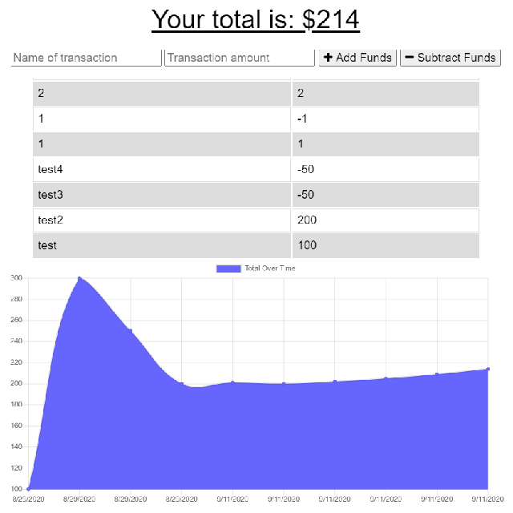

# budget_tracker

  ## Description:
  This is a PWA that allows offline transactions to be synced once application is online again.

  ## Links:
  * [Repo](https://github.com/locutusOO1/budget_tracker)
  * [Deployed Heroku Site](https://powerful-thicket-44511.herokuapp.com/)

  ## Table of Contents:
  * [Installation](#installation)
  * [Usage](#usage)
  * [Technology Used](#technology-used)
  * [Questions](#questions)
  * [Screenshots](#screenshots)

  ## Installation:
  * Install dependencies by running "npm install" from the terminal.
  
  ## Usage:
  * Run "npm start" from the terminal to start the server, then follow the link in the terminal to open the app in a browser.

  ## Technology Used:
  * Node.js - for JS runtime environment
  * JS/ES6+ - for program logic
  * MongoDB - for DB functionality
  * indexedDB - for storing offline transactions
  * PWA configuration - for offline functionality
  * MongoDB Atlas - for DB hosting
  * Express - for serving
  * Heroku - for site and DB hosting

  ## Questions:
  * Feel free to checkout my [GitHub Profile](https://github.com/locutusOO1).

  ## Screenshots:
  ### Workout Tracker:

  